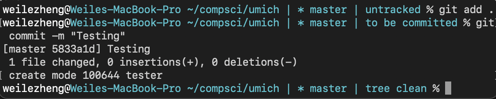

# Command Line Productivity Tools

Simple bash scripts for making life easier.


You can copy these scripts to your binary executable folder that are already in the PATH environment variable, or put in a new folder and add to the path in
_.zprofile_

---

# sstool

When creating contents or providing snapshot illustrations of a project, screenshots are oftenly used. However, the default screenshot names and directory of output for macOS is often hard to work with. Sstool is a simple script that could help organize these screen shot files.

### Usage

Before taking your series of screenshots, type the following command.

```
sstool -newset
```

Now, begin to take your screenshots that you would like to be grouped together.

Next

```
sstool -rename
```

This will rename all screenshots to img(n) where n range from 0 to your number of screenshots. This folder will be in the desktop directory

Finally, move the folder to your current directory with

```
sstool -dropin <optional parameter: new name for the folder>
```

You can repeat the process above for a new group of screenshots

<br />

# Git Tracking

Although most IDEs are now integrated with version controls, using git via the command line is still important and useful on many occasions. The gitTracking file help manage git version control in the terminal by showing

- If current directory is initiated as a repo
- The current branch
- The current status



Copy and paste the code into your ~/.zshrc profile or :

```
echo 'copy the code here' >> ~/.zshrc
```

<br />

# Bookmark

Manage and provide fast access to frequently used, bookmarked directories and files.

Since the script is running in a subshell and we look to change directory in the current session (parent shell of the script), we will need to source it in the zshrc file.

```
echo "Source [Script Path]" >> [zshrc path]
```

# Emoji

If your command ran successfully, you get a smiley face in your prompt. If you encounter an error, a sad face appears. Change to other emojis by inputting corresponding unicode to the emoji variable. Put the code in your .zshrc file, make sure to comment out your original export PROMPT(if you had one)
